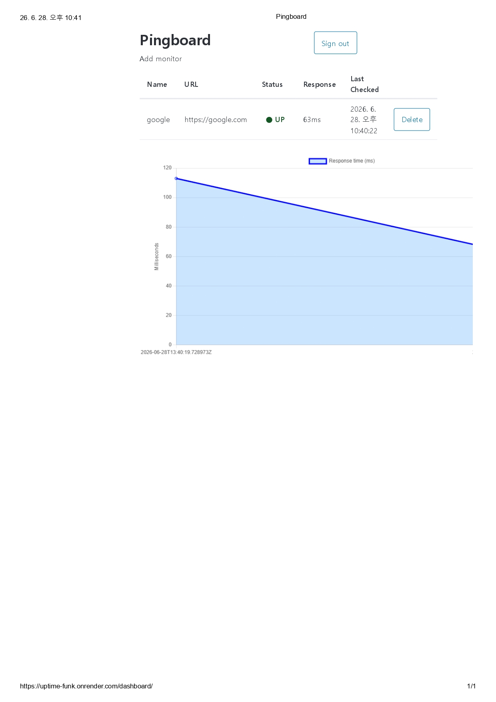

# uptime_funk

A lightweight uptime monitoring service that pings your URLs on a schedule, logs response times, and visualizes availability over time.

**Live demo:** [https://uptime-funk.onrender.com](https://uptime-funk.onrender.com)



---

## Architecture

```
Browser (Vanilla JS + Chart.js)
        │
        ▼
Django REST Framework (Render Web Service)
        │
        ├── PostgreSQL (Supabase)
        │
        └── /api/trigger_checks/  ◄─── cron-job.org (webhook, every 5 min)
```

Scheduled checks run via a cron-job.org webhook trigger, equivalent to an AWS EventBridge rule or Lambda scheduled event. Render's free web service spins down after 15 minutes of inactivity — a paid tier or alternative host would keep it always-on.

---

## Local Setup

```bash
git clone https://github.com/lukekim1237/uptime_funk.git
cd uptime_funk
python -m venv .venv && source .venv/bin/activate
pip install -r requirements.txt
python manage.py migrate
python manage.py runserver
```

---

## API Endpoints

| Method | Path | Description |
|--------|------|-------------|
| `POST` | `/api/token-auth/` | Exchange username + password for an auth token |
| `GET` / `POST` | `/api/monitors/` | List all monitors or create a new one |
| `GET` / `DELETE` | `/api/monitors/<id>/` | Retrieve or delete a specific monitor |
| `POST` | `/api/trigger_checks/` | Run checks for all monitors (secured via `CRON_SECRET`) |

---

## Skills Demonstrated

- **Django REST Framework** — serializers, viewsets, ownership-based access control
- **Token Authentication** — DRF `TokenAuthentication`, tokens stored in `sessionStorage`
- **Scheduled Tasks** — external cron trigger via cron-job.org webhook
- **PostgreSQL** — production database on Supabase via `dj-database-url`
- **Chart.js** — response time visualization with live data from the API
- **Docker** — containerized local development with `python:3.11-slim`
- **GitHub Actions CI** — runs migrations and unit tests on every push
- **Render Deployment** — production deploy with environment-based config and `build.sh`

---

## Known Limitations

- **Cold starts** — Render's free tier spins down after 15 minutes of inactivity, causing ~30s delays on first request
- **Admin only** — currently single superuser; multi-user self-registration is a planned extension
- **No alerting** — check failures are logged but don't trigger notifications (email/webhook alerts planned)